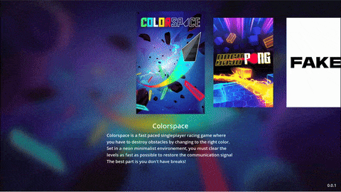

# Game launcher

A simple game launcher for developers to showcase their games. Especially useful during gaming conventions for example. 

*⚠ It's not aimed as being shipped with your game on Steam or other platforms.*

  

## How to add games

1. If not present, create a folder called **games** next to the executable.
2. Inside, create a folder for each game you want. The name of the folder will be the name of the game.
3. Place your executable, capsule image, background image and description.txt
4. The game executable will be launched by the launcher
5. The capsule must be named **capsule** with the following extensions supported: jpg, jpeg, png
6. The background image bust be named **bg** with the following extensions supported: jpg, jpeg, png
7. In **description.txt**, put the description you want to see below your game capsule in the launcher
8. Optionally, consider adding a **config.ini** for [advanced setup](#advanced-setup).

Here's an example folder  
game_launcher.exe  
├── games  
│   ├── Game name  
│   │   ├── game_executable.exe  
│   │   ├── capsule.jpg  
│   │   ├── bg.jpg  
│   │   └── config.ini  

You can also check the [**Fake**](games/Fake) folder to see a game example

## Advanced Setup

A **config.ini** can be used to customize a game. Using the config file you can set extended information such as release date, platforms, and even a QR code.

See the example config.ini file in the [**Fake**](games/Fake/config_fake.ini) for a full list of properties.

Note: If used, the "description" key will override the **description.txt**.

## How to navigate

Navigate using keyboard or gamepad using the usual keys used for navigation (arrows keys, enter).

`alt+enter` to toggle fullscreen

## Limitations

Right now, the launcher is only working with windows. Supporting linux and mac shouldn't be complicated, we just need to detect the correct extensions or file types. 

## Development

For development, you can use the **games** folder present in the project using the same configuration as explained above.

## 💁‍♂️ About me

Full time indie gamedev. You can find me everywhere 👇

- [Discord](https://discord.gg/83nFRPTP6t)
- [YouTube - Gamedev](https://www.youtube.com/@MrEliptik)
- [YouTube - Godot related](https://www.youtube.com/@mrelipteach)
- [Twitter](https://twitter.com/mreliptik) 
- [Instagram](https://www.instagram.com/mreliptik)
- [Itch.io](https://mreliptik.itch.io/)
- [All links](https://bento.me/mreliptik)

If you enjoyed this project and want to support me:

**Get exlusive content and access to my game's source code**

**One time donations**

